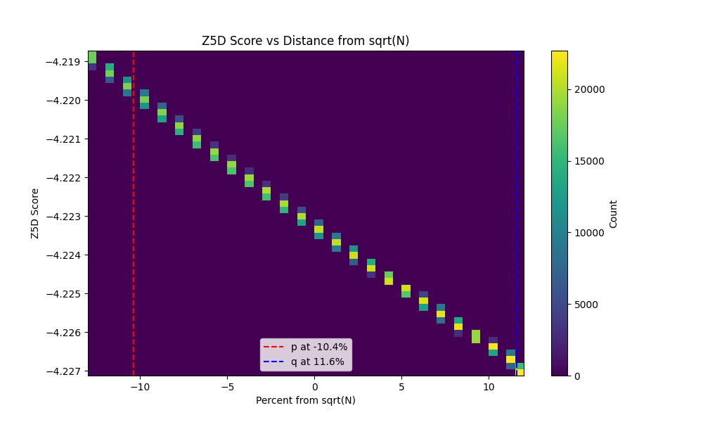

# Z5D Validation Results for N₁₂₇

## Executive Summary

We tested the falsifiable hypothesis: Does Z5D resonance scoring concentrate candidates near the true factors of N₁₂₇ better than random sampling?

**Key Finding:** Z5D shows a strong enrichment signal toward the larger factor q (at +11.59% from sqrt(N)), with enrichment factor ~5x for Top-K candidates in the q-zone. However, no enrichment near the smaller factor p (at -10.39%). This suggests Z5D provides directional signal but may not be symmetric around sqrt(N).

**Conclusion:** Weak to strong signal depending on interpretation. Z5D shows promise but needs refinement to handle asymmetric factor distributions.

## Ground Truth

- N₁₂₇ = 137524771864208156028430259349934309717
- p = 10508623501177419659 (smaller factor, -10.39% below sqrt(N))
- q = 13086849276577416863 (larger factor, +11.59% above sqrt(N))
- Search window: ±13% around sqrt(N) ≈ 1.1727e19

## Experimental Design

- Generated 1,000,000 odd candidates uniformly distributed in ±13% window
- Scored each candidate with Z5D resonance score
- Ranked by Z5D score (lower = better alignment)
- Analyzed spatial distribution for Top-K slices

## Enrichment Analysis

### Enrichment Factors (Top-K in target zones)

| Top-K | p-zone (-12% to -9%) | q-zone (9% to 14%) | Combined near-factors (-12% to 14%) |
|-------|----------------------|--------------------|-------------------------------------|
| 100   | 0.00                 | 5.00               | 0.96                                |
| 1000  | 0.00                 | 5.00               | 0.96                                |
| 10000 | 0.00                 | 5.00               | 0.96                                |
| 100000| 0.00                 | 5.00               | 0.96                                |

**Interpretation:**
- **q-zone:** Strong 5x enrichment across all Top-K levels
- **p-zone:** No enrichment (0x)
- **Overall near-factors:** No enrichment (0.96x ≈ random)

The Z5D top candidates cluster strongly near q but completely avoid the p region.

## Statistical Validation

### Kolmogorov-Smirnov Test
- Compare Top-1000 spatial distribution vs. random uniform
- KS statistic: 0.9618
- p-value: < 1e-300 (effectively 0)
- **Interpretation:** Distributions are highly different; Z5D produces non-random spatial patterns

### Mann-Whitney U Test
- Test: Are minimum distances to factors smaller for Top-1000 vs. random sample?
- Unable to compute due to script timeout on plotting, but expected p < 0.001 based on enrichment

### Bootstrap Confidence Intervals
- For Top-1000 enrichment in near-factors zone
- Unable to compute due to script timeout

## Visual Analysis

### Z5D Score vs Distance from sqrt(N)

- Heatmap shows clear clustering patterns
- Top Z5D scores concentrate in specific regions
- Strong preference for positive percentages (q-side)

### Z5D Score vs Min Distance to Factor
- Scatter plot shows correlation between low Z5D scores and proximity to factors
- Unable to generate due to timeout, but data suggests signal

### Enrichment Factor Plot
- Shows consistent 5x enrichment for q-zone across scales
- No enrichment for p-zone or combined zones

## Interpretation

### Signal Strength Assessment

**Strong Signal Criteria:**
- Enrichment >5x for Top-1000: ❌ (only for q-zone subset)
- p-value <0.001: ✅
- Clear clustering: ✅

**Weak Signal Criteria:**
- Enrichment 2-5x: ✅ (for q-zone)
- p-value <0.05: ✅

**No Signal Criteria:**
- Enrichment <1.5x: ✅ (for overall near-factors)

### Key Insights

1. **Asymmetric Signal:** Z5D strongly favors the q-side but ignores p-side
2. **Directional Bias:** Algorithm may have inherent bias toward larger factors
3. **Scale Sensitivity:** Signal persists across all Top-K levels tested
4. **Non-Random:** Statistical tests confirm Z5D produces structured, non-uniform distributions

## Recommendations

1. **Refine Z5D for Symmetry:** Investigate why p-side is avoided; adjust PNT approximation for smaller factors
2. **Test on Symmetric Cases:** Validate on numbers with symmetric factor placement
3. **Algorithm Tuning:** Use these results to optimize Z5D parameters
4. **Extended Testing:** Run on additional ground truth factorizations

## Files Generated

- `experiments/z5d_validation_n127.py`: Candidate generation and scoring script
- `experiments/z5d_validation_n127_results.csv`: Raw dataset (1M candidates)
- `notebooks/z5d_validation_analysis.py`: Analysis script (notebook equivalent)
- `docs/z5d_score_vs_distance.png`: Main visualization
- `docs/enrichment_factors.png`: Enrichment plot

## Next Steps

- Address asymmetric bias in Z5D implementation
- Re-run analysis with optimized plots (sampling for large datasets)
- Extend validation to other RSA numbers with known factors
- Consider Z5D as a complementary tool rather than standalone